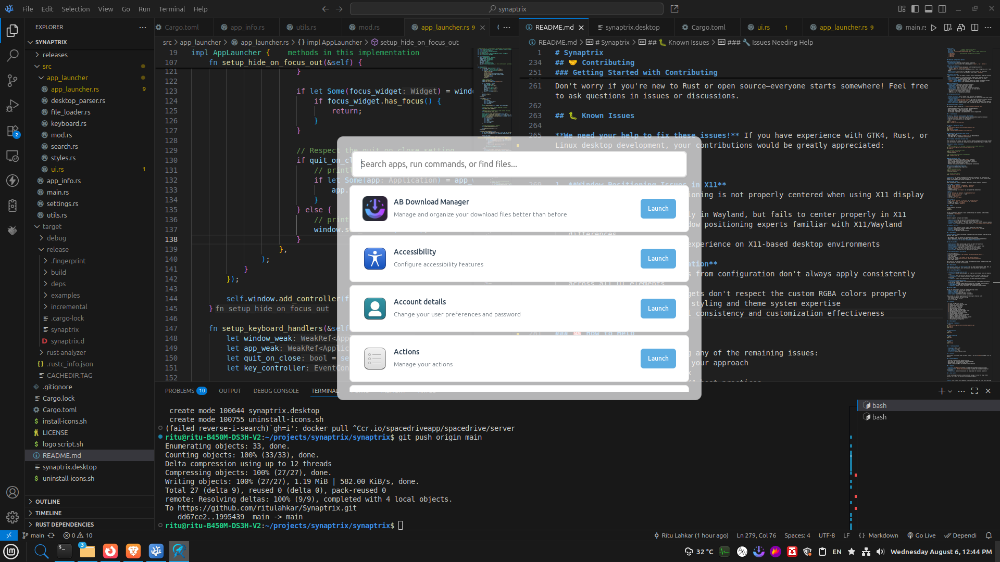

# Synaptrix

[](https://github.com/ritulahkar/synaptrix/releases)
[](https://www.gnu.org/licenses/gpl-3.0)
[](https://www.rust-lang.org/)
[](https://gtk.org/)

A fast, lightweight, and modern application launcher for Linux, built with Rust and GTK4, inspired by Synapse.



## 🚀 About

Synaptrix is a GPL3-licensed application launcher designed specifically for Linux Mint (and other Linux distributions). Born out of the need for a fast, reliable, and actively maintained launcher that captures the simplicity and efficiency of Synapse, Synaptrix leverages Rust's performance and safety combined with GTK4's modern UI toolkit to deliver a snappy user experience.

## ✨ Features

- **Lightning Fast**: Built in Rust for maximum performance and minimal resource usage
- **Modern UI**: Powered by GTK4 for a contemporary and responsive interface
- **Synapse-like Interface**: Familiar workflow for users coming from Synapse
- **Modern Architecture**: Clean, maintainable codebase designed for long-term sustainability
- **Linux Mint Optimized**: Thoroughly tested and optimized for Linux Mint environments
- **Wayland & X11 Support**: Works seamlessly on both display servers
- **Configurable**: Full customization through YAML configuration file
- **Dual Operation Modes**: Choose between daemon mode (stays in memory) or normal mode (exits on close)
- **Multiple Search Types**: Applications, files, recent files, and command execution
- **Open Source**: Fully open source under GPL3 license

## 🎯 Why Synaptrix?

The Linux desktop ecosystem was missing a fast, Rust-based launcher that:
- Actually works reliably
- Is actively maintained
- Provides the smooth Synapse-like experience users love
- Takes advantage of modern programming practices (Rust + GTK4)
- Offers extensive customization options

Synaptrix fills this gap by combining the best aspects of traditional launchers with modern Rust performance and GTK4's advanced UI capabilities.

## ⚙️ Configuration

Synaptrix uses a configuration file located at `~/.config/synaptrix/settings.yaml`. If the file doesn't exist, it will be created with default settings on first run.

### Sample Configuration

The configuration file is automatically created at `~/.config/synaptrix/settings.yaml` on first run with default values. You can customize it to suit your preferences:

```yaml
window:
  width: 700               # Window width in pixels
  height: 500              # Window height in pixels
  position: center         # Window position: center, top, bottom
theme:
  background_color: rgba(248, 249, 250, 0.30)  # RGBA: last value (0.30) controls transparency
  accent_color: rgba(52, 152, 219, 0.8)        # Color for highlights and selections
  text_color: '#2c3e50'                        # Text color in hex format
behavior:
  max_results: 50          # Maximum number of search results to display
  auto_close: true         # Close window after launching an item
  show_descriptions: true  # Show application descriptions in results
  quit_on_close: false    # Operation mode: false = daemon, true = normal
recent_files:
  enabled: true            # Enable recent files search
  max_files: 200          # Maximum files to track
  xbel_path: ~/.local/share/recently-used.xbel  # Path to XBEL recent files
  directories:
  - ~/Documents           # Directories to index for file search
  - ~/Downloads
  - ~/Desktop
  - ~/Pictures
```

### Detailed Configuration Options

#### Window Configuration
- **width/height**: Set the launcher window dimensions
- **position**: Control where the window appears (`center`, `top`, `bottom`)

#### Theme Customization
- **background_color**: Window background with transparency control
  - Format: `rgba(red, green, blue, alpha)`
  - Alpha value (0.0-1.0) controls transparency: 0.0 = fully transparent, 1.0 = fully opaque
- **accent_color**: Color used for highlights, selected items, and UI accents
- **text_color**: Color for all text elements (hex format: `#RRGGBB`)

#### Behavior Settings
- **max_results**: Limit the number of search results displayed to keep the interface clean
- **auto_close**: Whether to close the launcher window after selecting an item
- **show_descriptions**: Display descriptive text for applications and files
- **quit_on_close**: Controls operation mode
  - `false`: **Daemon Mode** - App stays in memory for instant subsequent launches
  - `true`: **Normal Mode** - App completely exits when window is closed

#### File Integration
- **recent_files**: Configure recent files tracking
  - **enabled**: Turn recent files search on/off
  - **max_files**: Limit how many files to track
  - **xbel_path**: Path to the system's recent files database
- **directories**: List of directories to index for file search
  - Add any directories you frequently access
  - Supports `~` for home directory expansion
  - Subdirectories are automatically included

### Configuration Options

- **Window Settings**: Control window size, position, and appearance
- **Theme Customization**: Set colors, transparency (4th RGBA value), and visual style
- **Operation Modes**:
  - **Daemon Mode** (`quit_on_close: false`): App stays in memory for instant launches
  - **Normal Mode** (`quit_on_close: true`): App exits when window closes
- **Search Behavior**: Configure result limits, descriptions, and auto-close behavior
- **File Integration**: Enable recent files tracking and specify directories to index

### Configuration File Location

The settings file is located at: `~/.config/synaptrix/settings.yaml`

- Created automatically on first run with sensible defaults
- Fully customizable - edit with any text editor
- Changes take effect after restarting Synaptrix
- If corrupted or deleted, a new default file will be regenerated

## 🛠️ Installation

### Option 1: Download Latest Release (Recommended)
1. Go to the [Releases page](https://github.com/ritulahkar/synaptrix/releases)
2. Download the latest binary for your architecture
3. Make it executable and move to system path:
```bash
chmod +x synaptrix
sudo mv synaptrix /usr/local/bin/
```

### Option 2: Build from Source
```bash
git clone https://github.com/ritulahkar/Synaptrix.git
cd synaptrix
cargo build --release
sudo cp target/release/synaptrix /usr/local/bin/
```

### Dependencies (for building from source)
- Rust 1.70 or later
- GTK4 development libraries (`libgtk-4-dev` on Ubuntu/Debian)
- Linux Mint 20+ (or compatible distributions)

### Setting Up Hotkey
After installation, set up a keyboard shortcut to launch Synaptrix instantly:

**Linux Mint / Cinnamon:**
1. Go to `System Settings` → `Keyboard` → `Shortcuts`
2. Click `Custom Shortcuts` → `Add custom shortcut`
3. Name: `Synaptrix Launcher`
4. Command: `synaptrix`
5. Keyboard binding: `Ctrl+Space` (or your preferred combination)

**GNOME:**
1. Go to `Settings` → `Keyboard` → `Keyboard Shortcuts`
2. Click `Custom Shortcuts` → `+` (Add)
3. Name: `Synaptrix Launcher`
4. Command: `synaptrix`
5. Set shortcut: `Ctrl+Space`

**KDE Plasma:**
1. Go to `System Settings` → `Shortcuts` → `Custom Shortcuts`
2. Right-click → `New` → `Global Shortcut` → `Command/URL`
3. Trigger tab: Set to `Ctrl+Space`
4. Action tab: Command: `synaptrix`

## 🚀 Usage

Launch Synaptrix by running:
```bash
synaptrix
```

Or set up a keyboard shortcut in your system settings to launch it with a hotkey (recommended: `Ctrl+Space`).

### Search Types

Synaptrix supports multiple search modes:

- **Applications**: Type to search for installed applications
- **Files**: Search through configured directories and recent files
- **Commands**: Start typing `/` followed by your command to execute terminal commands
- **Recent Files**: Access recently used files from `~/.local/share/recently-used.xbel`

### Keyboard Shortcuts

- **Ctrl+Q**: Exit Synaptrix (works in both daemon and normal modes)
- **Escape**: Close window (behavior depends on `quit_on_close` setting)
- **Enter**: Launch selected item
- **Arrow Keys**: Navigate through results

## 🤝 Contributing

**Important Note**: I'm a self-taught programmer who builds projects with the help of AI tools. This means:

- The codebase might not follow all best practices initially
- There's definitely room for improvement in architecture and implementation
- **Your contributions are not just welcome—they're essential!**

### How You Can Help

- **Code Reviews**: Help improve code quality and Rust best practices
- **Bug Reports**: Found an issue? Please report it!
- **Feature Requests**: Have ideas for new features? Let's discuss them!
- **Documentation**: Help improve documentation and user guides
- **Testing**: Test on different Linux distributions and hardware
- **Refactoring**: Help modernize and optimize the codebase

### Getting Started with Contributing

1. Fork the repository
2. Create a feature branch (`git checkout -b feature/amazing-feature`)
3. Make your changes
4. Test thoroughly
5. Commit your changes (`git commit -m 'Add amazing feature'`)
6. Push to the branch (`git push origin feature/amazing-feature`)
7. Open a Pull Request

Don't worry if you're new to Rust or open source—everyone starts somewhere! Feel free to ask questions in issues or discussions.

## 🐛 Known Issues

**We need your help to fix these issues!** If you have experience with GTK4, Rust, or Linux desktop development, your contributions would be greatly appreciated:

### 🔧 Critical Issues Needing Help

1. **Window Positioning Issues in X11**
   - **Problem**: Window positioning is not properly centered when using X11 display server
   - **Status**: Works correctly in Wayland, but fails to center properly in X11
   - **Help Needed**: GTK4 window positioning experts familiar with X11/Wayland differences
   - **Impact**: Affects user experience on X11-based desktop environments

2. **Missing Application Icon in Taskbar**
   - **Problem**: Synaptrix doesn't display its logo/icon in the system taskbar
   - **Status**: Icon files exist but aren't properly registered with the window manager
   - **Help Needed**: GTK4 application icon setup and desktop integration knowledge
   - **Impact**: Makes it harder to identify the application when running

3. **Inconsistent Theme Application**
   - **Problem**: Custom themes from configuration don't always apply consistently across all UI elements
   - **Status**: Some GTK4 widgets don't respect the custom RGBA colors properly
   - **Help Needed**: GTK4 CSS styling and theme system expertise
   - **Impact**: Reduces visual consistency and customization effectiveness

### 🆘 How to Help

If you can contribute to fixing any of these issues:
- **Open an issue** to discuss your approach
- **Submit a PR** with your fix
- **Share knowledge** about GTK4 best practices
- **Test fixes** on different desktop environments

These issues are perfect opportunities for developers familiar with:
- GTK4 window management and positioning
- Linux desktop integration standards
- GTK4 theming and CSS systems
- Rust-GTK4 bindings

## 📋 Roadmap

- [x] YAML configuration system
- [x] Daemon and normal operation modes
- [x] Command execution support
- [x] Recent files integration
- [x] Directory file indexing
- [x] Wayland compatibility
- [x] GTK4 modern UI implementation
- [ ] Fix X11 window positioning issues
- [ ] Fix taskbar icon display
- [ ] Improve theme consistency
- [ ] Complete feature parity with Synapse
- [ ] Plugin system for extensibility
- [ ] Enhanced themes and customization options
- [ ] Multi-monitor support improvements
- [ ] Package manager integration

## 🔧 Development

### Building from Source
```bash
git clone https://github.com/ritulahkar/synaptrix.git
cd synaptrix
cargo build
```

### Running Tests
```bash
cargo test
```

### Code Formatting
```bash
cargo fmt
```

### Linting
```bash
cargo clippy
```

## 🛠️ Technology Stack

- **Language**: Rust 1.70+
- **UI Framework**: GTK4
- **Configuration**: YAML
- **Platform**: Linux (Wayland & X11)

## 📝 License

This project is licensed under the GPL3 License - see the [LICENSE](LICENSE) file for details.

## 🙏 Acknowledgments

- Inspired by the original Synapse launcher
- Built with the Rust programming language and GTK4
- Developed with assistance from AI tools
- Thanks to the Linux Mint and broader Linux community

## 📞 Support

- **Issues**: [GitHub Issues](https://github.com/ritulahkar/synaptrix/issues)
- **Discussions**: [GitHub Discussions](https://github.com/ritulahkar/synaptrix/discussions)
- **Community**: Join our discussions and help shape the future of Synaptrix!

## 🌟 Star History

If you find Synaptrix useful, please consider giving it a star! It helps others discover the project and motivates continued development.

---

**Note**: This project is a community effort built with Rust and GTK4. As a learning developer, I rely on the expertise and contributions of the community to make Synaptrix the best launcher it can be. Every contribution, no matter how small, makes a difference!